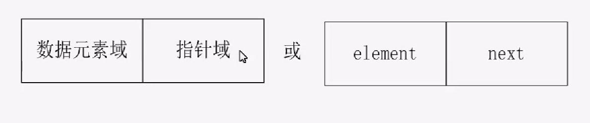
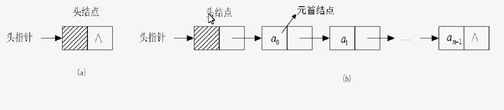
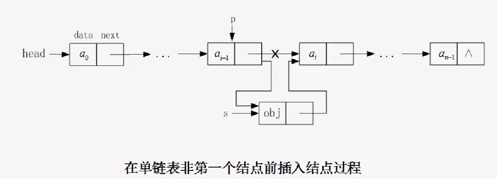
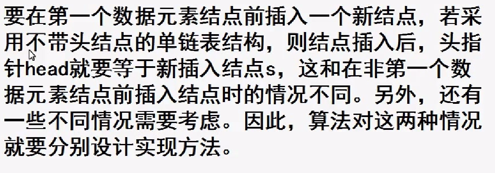
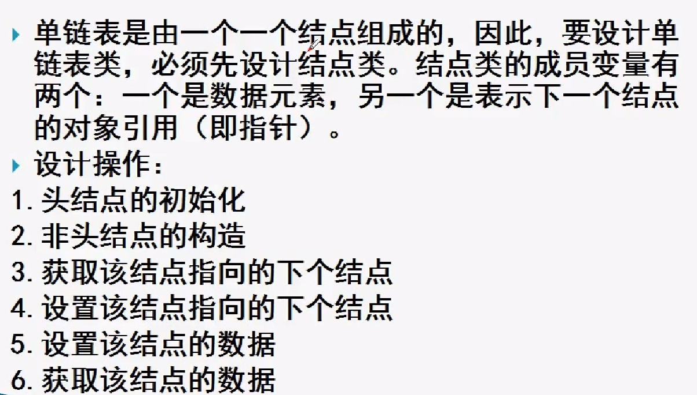
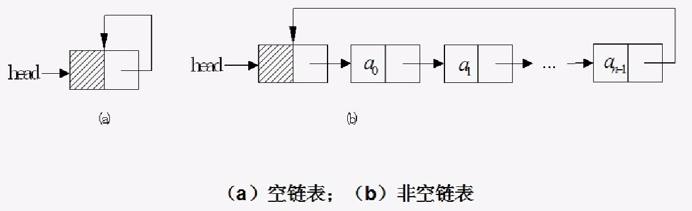

### 链表结构
1. 链式存储结构是基于指针实现的，我们把一个数据元素和一个指针称为一个节点
2. 链式存储结构是使用指针把相互关联的节点，（直接前驱节点和直接后继节点）连接起来，
链式存储结构的线性表称为链表

### 单链表的结构
单链表 : 构成链表每个节点只有一个指向直接后继节点的指针
单链表的表示方法，以及单链表中每个节点的结构如下:

单链表有两种结构，带头结点的结构和不带头结点的结构。我们把指向单链表的指针称为单链表的头指针
头指针所指向的不存放数据的第一个节点称为头节点，存储第一个数据元素的节点称为首元节点
顺序如下（头指针--->头结点---->首元结点）

单链表插入元素

所以使用带头结点的单链表的算法比较简单

### 单向循环链表

单向循环链表是单链表的另一种形式，其结构特点是链表中的最后一个节点的指针不再是结束标志、
而是指向整个链表的第一个节点，从而使整个链表形成一个环，和单链表相比，循环链表的长处是从
尾到链头比较方便，当要处理的数据元素序列具有环形结构特点时候，适合使用循环单链表。

### 单向循环链表的结构

1. 和单向循环链表相同，循环单链表也有两种，带头结点的和不带头结点的，带头结点的单链表在实现
插入和删除的操作的时候比较简单。
2.带头结点的单链表结构如下图

### 单向循环链表
带头结点的单向循环链表的操作实现方法和带头结点的单链表的操作实现方法类同，差别
1. 在构造方法中，要加一条head.next = head 语句，把初始时的带头节点的循环单例表设计成图所示状态
2. 在index(i)成员函数中，把循环结束判断条件中的current != null 改为  current != head
